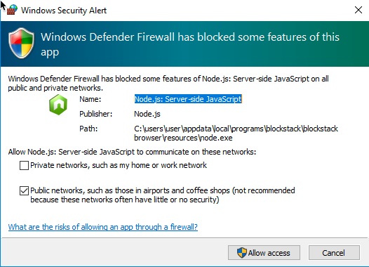
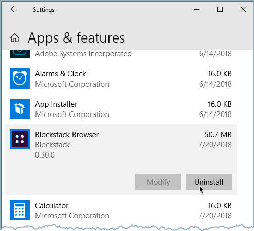

# Use the Blockstack Browser
{:.no_toc}

The Blockstack Browser gives users the ability to explore and use the
decentralized applications (dapps). The decentralized applications are a new way
to interact with the internet. Dapps give users control of their data. Data
about them personally, name, birthdate, phone number and data about what they do
such as visiting a website or buying an item.

* TOC
{:toc}

## Understand the Blockstack Browser

Through the Blockstack browser application you can create an identity. An identity
represents you as you interact with others through Dapps.  The Blockstack
Browser is itself, a simple Dapp. It allows you to:

* create one or more identities
* send and receive bitcoin
* manage the storage of your profile and application data
* find and launch Dapps

There are editorions of the Blockstack Browser, the web edition is an
application you access through your web browser by simply [visit the
applications' address](https://browser.blockstack.org/) in your computer's
browser.  You can also install the browser as a client application on your
computer.

If all you want to do is create, manage, and fund an identity and then interact
with Dapps, you can simply use the web edition. If you have concerns about net
censorship, hightened security concerns, or develop a Dapp yourself, you may
want to download and install the browser's client edition.

## Using the Browser on public computers

Before you use the web application, it is important to note that once you log
into the application with the brower, your session does not expire until you
choose **Settings > RESET BROWSER**.  For this reason, you should be careful
when using the browser on public computers.

If you are in a library, for example, and log into the browser, simply
closing the tab or even rebooting the computer does not log you out. Instead,
you should be sure to choose **Settings > RESET BROWSER** before leaving the web
application.

For more informatin about your identity and the browser, see [Get and use a Blockstack IDs](ids-introduction).

## Install the client edition

Remember, for most users the Blockstack Browser web application should
suffice. You only need to install the client if you have additional, advanced
concerns about Internet or identity. Though not required, some Dapp developrs
may find it useful to install the client edition.

The Blockstack Browser installer is a _multiple-context_ installer. If you
run it as a user, the installation is avalable only for that user. If you
install as administrator, the installation installs for all users. To find an
installer for your operating system, visit [the Blockstack install
page](https://blockstack.org/install).

### On Mac

Installation requires that you have macOS High Sierra 10.12 or higher. Do the following to install:

1. Download the OSX installer from [the browser installation page](https://blockstack.org/install).
2. Double-click the downloaded DMG file to launch the installer.

   

3. Drag the Blockstack.app to the `Applications` folder.
4. Double-click the Blockstack.app to launch it.

   The system displays a notice about opening the file:

   

5. Choose **Open**.

   The system opens your default browser with the Blockstack Browser
   application, running from your machine (localhost). You'll also see the
   Blockstack icon in your machine's

   

   If you have loaded an identity already via the Blockstack web application,
   you are already logged into the local application:

   


### On Windows

Installation requires that you have Windows 10 or higher. Do the following to
install:

1. Download the Windows installer from from [the browser installation page](https://blockstack.org/install).
2. Double-click the installer package to launch it.

   

3. Open the Wiindows **Start** menu and click on the recently added **Blockstack Browser**.

   

   The system displays a Windows Security Alert.

   

4. Choose to **Allow access**.

   The system opens in the Blockstack Browser application.

    


### On Linux

The Blockstack installation on Linux requires Docker. Before installing
Blockstack, [install the version of Docker appropriate for your operating system](https://docs.docker.com/install/).

>**Note**: The Blockstack script used in this procedure runs `docker` commands. Depending on how you installed and configure Dockered on your system, it may or may not be necessary to have `root` or `sudo` privileges.  For this reason, the commands below show the use of `sudo` when interacting with the script or the `docker` executable. If your installation allows running Docker with lower privileges, you can omit it.


1. Download the Linux installer from from [the browser installation page](https://blockstack.org/install).

   This downloads a `Blockstack-for-Linux-v0.30.0.sh` script to your local drive.

2. Open a terminal and navigate to the directory containing the downloaded script.

   When the script downloads, it is not executable.

3. Set the executable bit on the file.

    ```bash
    $ chmod u+x Blockstack-for-Linux-v0.309.0.0.sh
    ```

4. Enter the command without any arguments to see the available subcommands.

    ```bash
    $ sudo ./Blockstack-for-Linux-v0.309.0.0.sh
    blockstack docker launcher commands:
    Install-protocol-handler -> install a protocol handler for blockstack:// links
    ...
    ```

5. Use the script to `pull` the Blockstack Docker images you need.


    ```bash
    $ sudo ./Blockstack-for-Linux-v0.309.0.0.sh pull
    ```

    Depending on your network speed, this can take some time.

7. Use the `docker image ls` command to confirm you have the image.

    ```bash
    $ sudo docker image Is
    REPOSITORY	TAG	IMAGE ID	CREATED
    quay.io/blockstack/blockstack-browser	v0.30.0	ad05fd844f59	2 days ago
    ```

8. Install the protocol handler

    ```bash
    $  sudo ./Blockstack-for-Linux-vO.30.0.sh install-protocol-handler

    Registering protocol handler
    ```

9. Start the Blockstack containers.

    ```bash
    $ sudo ./Blockstack-for-Linux-vO.30.0.sh start
    c3092592e59abe3559fdb49d070a7aa5e99165c7d9f2flla20ecaf4e0dfc2f46

    cd92f61ae473d54398da987f5023f5462b29c03f08584ebb3c9fIbb4cd790c69

    Registering protocol handler
    ```

    The system launches the Blockstack Browser application for you.

    

Until you stop the Blockstack containers, the application will continue to run
on your system. To display the status of the Blockstack containers, you can use
the `docker container ls` command.


```bash
$ sudo docker container ls --format '{{.ID}}\t{{.Image}}\t{{.Status}}\t{{.Ports}}\t{{.Names}}'
```


Use `./Blockstack-for-Linux-vO.30.0.sh stop` to stop the Blockstack Browser and its containers.


## Uninstall the browser

If you installed the browser using an installer, follow the instructions for
your operating system.

### On Mac

1. Quit the Blockstack application if it is running.

   

2. Check if you have a Blockstack device and eject it if you do.

   

3. Use the Finder to open the **Applications** folder.
4. Locate the Blockstack application.
5. Open your `Applications` folder and locate the **Blockstack.app**.
6. Drag the appliation to the trash.
7. Delete the `/Users/USERNAME/Library/Application Support/Blockstack` folder.

   From the command line:

   ```bash
   $ rm -r /Users/moxiegirl/Library/Application\ Support/Blockstack
   ```

### On Windows

1. Open the **Start** menu.
2. Click **Settings > System**.
3. Open for the **Apps & features** item.

   

4. Locate the **Blockstack Browser** and choose **Uninstall**.

   


### On Linux

Your Blockstack instalaltion relies on Docker containers and their associated
images.  It also includes a supporting protocol handler you must remove.  If you
installed Docker so that you can run Blockstack, you can uninstall Docker as well,
but that is not explained here.

Do the following to uninstall Blockstack:

1. Stop and remove the Docker containers if they are running.

    ```bash
    $ sudo ./Blockstack-for-Linux-vO.30.0.sh stop
    stopping the running blockstack-browser containers
    69a686799d4f
    56fc6189ff97
    69a686799d4f
    56fc6189ff97
    ```

2. Remove the associated Blockstack images.

    ```bash
    $ sudo docker image ls
    REPOSITORY	                          TAG	    IMAGE ID	    CREATED
    quay.io/blockstack/blockstack-browser	v0.30.0	ad05fd844f59	3 days ago
    $ sudo docker image rm ad05fd844f59

    Untagged : quay.io/blockstack/blockstack- browser :vO.30.0
    Untagged: quay.io/blockstack/blockstack-browser@sha256:b20c9514c56b99398fd4946af39e7537b807e85694943ac3b8807dlb3625833b
    Deleted: Sha256:ad05fd844f5948blee06a0a09228df946478393c0a7588cbc65dlb8817f5b34e
    Deleted: Sha256:7c3d0043f2ba01cf285f3fe09701b086c349b6380c2e42f25b31ac65c6626ec8
    Deleted: sha256:54ea2aa7d7d000e7483f299eeca9e5466fa86231f4cd4cld3c3096d97e61c5df
    Deleted: sha256:38e61054355adefc3c2de031462114a9946cfc0e44444a38a27d0f115aba0da2
    ....
    ```

3. Use the script to remove the protocol handler

    ```bash
    $ sudo ./Blockstack-for-Linux-vO.30.0.sh remove-protocol-handler
    ```

4. Delete the script.

    ```bash
    $ rm Blockstack-for-Linux-vO.30.0.sh
    ```
